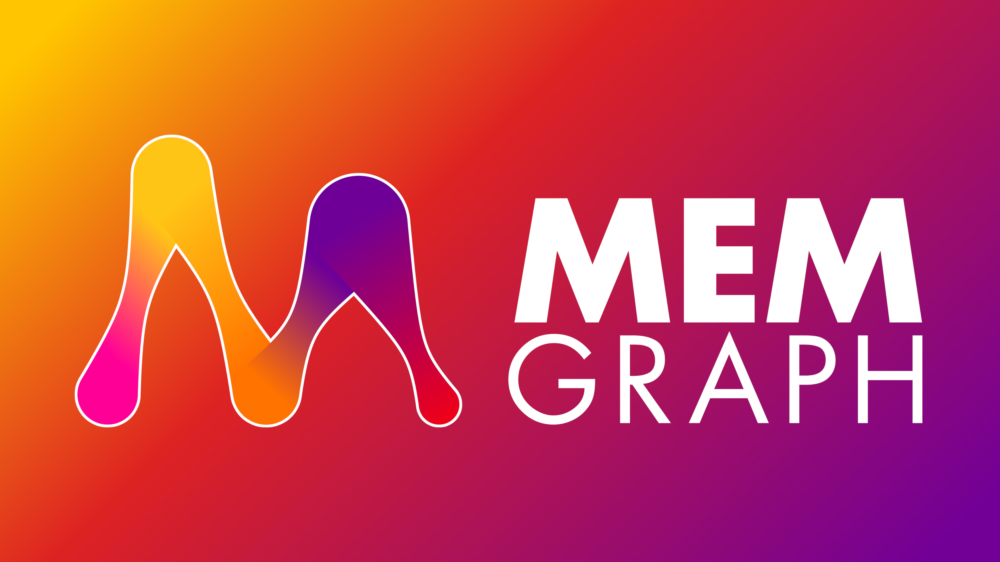
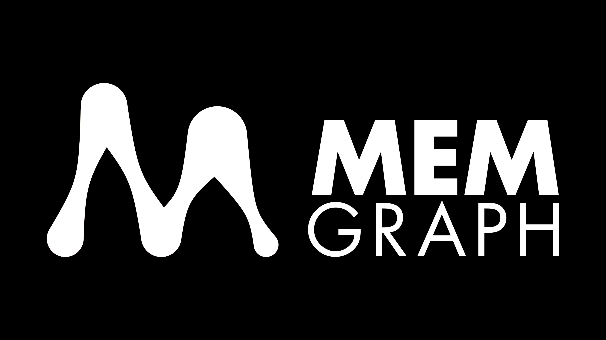
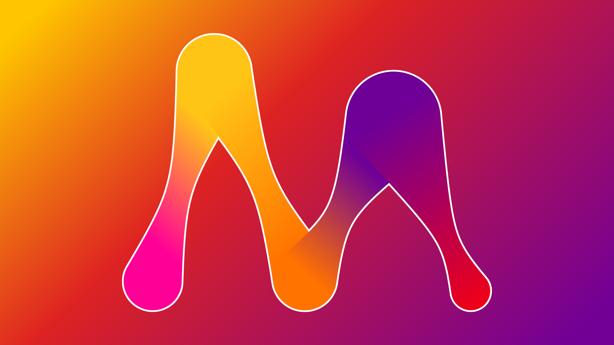

# memgraph wallpapers

Come and fetch yours!

Probably best to take 4k wallpapers and downscale to your needs.
The FHD ones are kind of blurry.

The wordclouds are generated with [memgraph-wordcloud](https://github.com/MasterMedo/memgraph-wordcloud).

